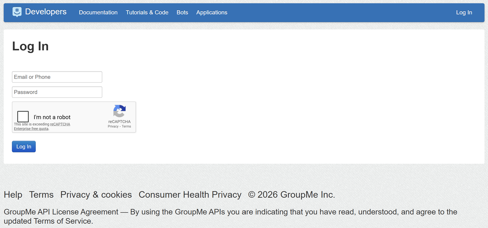
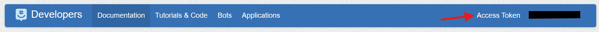
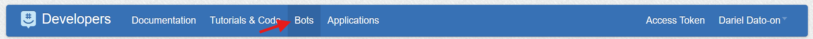

# openclaw-groupme

An [OpenClaw](https://github.com/oddrationale/openclaw) channel plugin that brings your AI agent into GroupMe group chats. It hooks into GroupMe's Bot API via webhooks so your agent can receive messages, understand context, and reply — all within the group conversations your team (or friends) are already having. Group chats only; DMs are not supported by the GroupMe Bot API.

## Install

```bash
openclaw plugins install openclaw-groupme
```

After installing, restart the gateway so it picks up the new plugin:

```bash
openclaw gateway restart
```

That's it — the plugin is loaded and ready to configure.

## Prerequisites

Before you start wiring things up, make sure you have three things ready:

### 1. A GroupMe group

Bots in GroupMe live inside groups — there's no way to DM a bot directly. If you don't have one already, create a group using the [GroupMe web app](https://web.groupme.com/) or one of the mobile apps. You can also use an existing group you're already in.

### 2. A GroupMe access token

Head over to [dev.groupme.com](https://dev.groupme.com) to grab your access token.

**Heads up:** You must have a username and password set up on your GroupMe account to log in to the developer portal. The single sign-on options (Google, Microsoft, etc.) won't work here — only the classic email/phone + password login.



Once you're logged in, your access token is displayed in the top-right corner of the page. Click on it to copy.



> **Keep your access token secret.** This token has full access to your GroupMe account — it can post messages, join groups, manage bots, and more. Treat it like a password. Unfortunately, the only known way to revoke a compromised token is to change your GroupMe password, which isn't documented anywhere by GroupMe. So guard it carefully.

### 3. A public HTTPS URL

GroupMe needs to reach your OpenClaw gateway over the internet to deliver messages. You'll need a public HTTPS URL that routes to your gateway's webhook endpoint.

How you set this up depends entirely on your environment — a reverse proxy (Nginx, Caddy, Traefik), a Cloudflare tunnel, ngrok, Tailscale, or any number of other approaches will work. The important thing is:

- The URL must be **HTTPS** (GroupMe requires it).
- Only expose the **callback path** (e.g., `/groupme/...`) — don't open your entire gateway to the public internet.
- The domain must be **live and reachable** at setup time, because GroupMe pings the callback URL when you register a bot.

We can't cover every possible network setup here, but at the end of the day you need a public `https://your-domain.com/groupme/...` URL that reaches your OpenClaw gateway.

## Setup: Interactive Wizard (Recommended)

The interactive wizard is the easiest way to get started. It creates a new GroupMe bot, registers the callback URL, and writes all the config for you.

**1.** Run the channel setup command:

```bash
openclaw channels add
```

**2.** When asked "Configure chat channels now?", select **Yes**.

**3.** Use the arrow keys to select **GroupMe** from the channel list.

**4.** Enter a **bot name**. This is the display name your bot will use in the group (e.g., `openclaw`). This name is also used for mention detection.

**5.** Paste your **GroupMe access token** when prompted.

**6.** The wizard fetches your groups from GroupMe. **Select the group** you want the bot to live in.

**7.** Choose whether to **require an @mention**:
   - **Yes** — The bot only responds when someone mentions it by name (e.g., "hey @openclaw, what's the weather?"). This is great for groups with multiple people where you don't want the bot jumping into every conversation.
   - **No** — The bot responds to every message in the group. Perfect if you're the only human in the group and want a direct chat experience.

**8.** Enter the **public domain** that will host your callback URL. This should be the domain name (or public IP) that can reach your OpenClaw gateway — for example, `bot.example.com`. The wizard generates a secure callback URL with a random path and secret token.

**9.** The wizard registers the bot with GroupMe and writes the config. You'll see a summary of what was created.

**10.** Restart the gateway:

```bash
openclaw gateway restart
```

**11.** Send a test message in the GroupMe group. If everything is wired up correctly, your bot should respond. Make sure your reverse proxy or port forwarding is configured to route the callback URL to your gateway.

## Setup: Non-Interactive CLI

If you already have a GroupMe bot created (maybe from the [Bots page](https://dev.groupme.com/bots) on the developer portal) and want a scriptable setup, use the CLI flags directly:



```bash
openclaw channels add --channel groupme \
  --token "YOUR_GROUPME_BOT_ID" \
  --access-token "YOUR_GROUPME_ACCESS_TOKEN" \
  --webhook-url "/groupme/callback?k=YOUR_SECRET"
```

For named accounts (useful if you're running multiple bots):

```bash
openclaw channels add --channel groupme \
  --account work \
  --name "Work Bot" \
  --token "YOUR_GROUPME_BOT_ID" \
  --access-token "YOUR_GROUPME_ACCESS_TOKEN" \
  --webhook-url "/groupme/callback?k=YOUR_SECRET"
```

| Flag | Maps to config | Description |
| ---- | -------------- | ----------- |
| `--token` | `botId` | Your GroupMe Bot ID |
| `--access-token` | `accessToken` | Your GroupMe access token |
| `--webhook-url` | `callbackUrl` | Full relative webhook URL (path + query token) |
| `--webhook-path` | `callbackUrl` | Alias for `--webhook-url` |
| `--account` | account ID | Named account identifier |
| `--name` | `name` | Display name for the account |

> **Note:** The non-interactive CLI does not prompt for `botName`, `groupId`, `requireMention`, or `publicDomain`. You can add these manually in your config file afterward, or set them via environment variables.

After adding the channel, make sure the callback URL you gave GroupMe (when you created the bot) matches what you passed to `--webhook-url`. Then restart the gateway:

```bash
openclaw gateway restart
```

## Manual Config Example

If you prefer editing config files directly, here's what a complete setup looks like:

```yaml
channels:
  groupme:
    enabled: true
    botName: "openclaw"
    accessToken: "YOUR_GROUPME_ACCESS_TOKEN"
    botId: "YOUR_GROUPME_BOT_ID"
    groupId: "YOUR_GROUPME_GROUP_ID"
    publicDomain: "bot.example.com"
    callbackUrl: "/groupme/e60b3e59da98950f?k=YOUR_SECRET_TOKEN"
    requireMention: true
```

## Response Modes

### Always respond (`requireMention: false`)

The bot replies to every message in the group. Simple and direct.

```yaml
channels:
  groupme:
    requireMention: false
```

### Mention only (`requireMention: true`, default)

The bot only replies when someone mentions it by name. It still passively buffers recent messages so it has context when it does respond.

```yaml
channels:
  groupme:
    requireMention: true
    historyLimit: 30
```

Set `historyLimit: 0` to disable history buffering entirely.

### How Mention Detection Works

GroupMe bots don't support native @mention entities, so this plugin uses text matching. By default, it matches the `botName` in the message text. You can add custom patterns too:

```yaml
channels:
  groupme:
    botName: "openclaw"
    mentionPatterns:
      - "@openclaw"
      - "hey openclaw"
      - "oc"
```

Patterns are case-insensitive regular expressions, so you can get creative with matching.

## Security

The plugin ships with some security defaults out of the box. Replay protection and rate limiting are always on — you don't need to configure anything for a solid baseline.

### Inbound Webhook Pipeline

Every incoming webhook request goes through this gauntlet before your agent ever sees it:

1. **Method check** — Only `POST` requests are accepted (405 for everything else)
2. **Callback token auth** — The `k` query parameter in the callback URL is verified using timing-safe comparison
3. **Proxy validation** — If configured, validates trusted proxy headers, allowed hosts, and HTTPS protocol
4. **Body parsing** — 64KB size limit, 15-second timeout
5. **Payload parsing** — Extracts the GroupMe callback data and filters out bot messages, system messages, and empty messages
6. **Group binding** — Verifies the inbound `group_id` matches the configured `groupId`
7. **Replay protection** — SHA-256 keyed deduplication with a sliding TTL window
8. **Rate limiting** — Per-IP, per-sender, and global concurrency caps

### Outbound Media Security

When the bot sends image replies, outbound media fetches are hardened with:

- SSRF guard with private-network blocking (enabled by default)
- MIME type allowlist (images only by default)
- Download size limit (15 MB)
- Request timeout (10 seconds)

### Security Config Reference

You only need a `security` block if you want to override the defaults. Just include the fields you want to change:

```yaml
channels:
  groupme:
    security:
      rateLimit:
        maxRequestsPerIp: 60
      proxy:
        trustedProxyCidrs: ["10.0.0.0/8"]
        allowedPublicHosts: ["bot.example.com"]
        requireHttpsProto: true
```

#### Replay Protection

| Field | Type | Default | Description |
| ----- | ---- | ------- | ----------- |
| `security.replay.ttlSeconds` | number | `600` | How long (in seconds) to remember message IDs for deduplication |
| `security.replay.maxEntries` | number | `10000` | Maximum number of entries in the replay cache |

#### Rate Limiting

| Field | Type | Default | Description |
| ----- | ---- | ------- | ----------- |
| `security.rateLimit.windowMs` | number | `60000` | Sliding window size in milliseconds |
| `security.rateLimit.maxRequestsPerIp` | number | `120` | Max webhook requests per IP per window |
| `security.rateLimit.maxRequestsPerSender` | number | `60` | Max webhook requests per GroupMe sender per window |
| `security.rateLimit.maxConcurrent` | number | `8` | Max concurrent inbound message executions |

#### Media

| Field | Type | Default | Description |
| ----- | ---- | ------- | ----------- |
| `security.media.allowPrivateNetworks` | boolean | `false` | Allow fetching media from private/internal networks |
| `security.media.maxDownloadBytes` | number | `15728640` | Max download size for outbound media (bytes) |
| `security.media.requestTimeoutMs` | number | `10000` | Timeout for outbound media fetch requests (ms) |
| `security.media.allowedMimePrefixes` | string[] | `["image/"]` | Allowed MIME type prefixes for outbound media |

#### Logging

| Field | Type | Default | Description |
| ----- | ---- | ------- | ----------- |
| `security.logging.redactSecrets` | boolean | `true` | Redact callback secrets in logs and status output |
| `security.logging.logRejectedRequests` | boolean | `true` | Log rejected webhook requests |

#### Command Bypass

| Field | Type | Default | Description |
| ----- | ---- | ------- | ----------- |
| `security.commandBypass.requireAllowFrom` | boolean | `true` | Require sender to be in `allowFrom` list to use control commands |
| `security.commandBypass.requireMentionForCommands` | boolean | `false` | Require mention even for control commands |

#### Proxy Validation

Include a `proxy` block to enable trusted-proxy validation. This is useful when your gateway sits behind a reverse proxy and you want to validate forwarded headers.

| Field | Type | Default | Description |
| ----- | ---- | ------- | ----------- |
| `security.proxy.trustedProxyCidrs` | string[] | `[]` | Only trust `X-Forwarded-*` headers from these CIDRs |
| `security.proxy.allowedPublicHosts` | string[] | `[]` | Allowed values for the effective public host |
| `security.proxy.requireHttpsProto` | boolean | `false` | Require the effective protocol to be HTTPS |
| `security.proxy.rejectStatus` | number | `403` | HTTP status for proxy-policy rejections (`400`, `403`, or `404`) |

## Environment Variables

For the default account, you can use environment variables instead of (or alongside) config file values. This is handy for CI/CD, Docker deployments, or anywhere you'd rather not put secrets in a config file.

| Variable | Maps to config | Description |
| -------- | -------------- | ----------- |
| `GROUPME_BOT_ID` | `botId` | GroupMe Bot ID |
| `GROUPME_ACCESS_TOKEN` | `accessToken` | GroupMe access token |
| `GROUPME_BOT_NAME` | `botName` | Bot display name |
| `GROUPME_GROUP_ID` | `groupId` | GroupMe group ID |
| `GROUPME_PUBLIC_DOMAIN` | `publicDomain` | Public domain for the callback URL |
| `GROUPME_CALLBACK_URL` | `callbackUrl` | Relative webhook URL (path + query token) |

If both a config value and an environment variable are set, the **config value wins**. Environment variables only apply to the default account — named accounts must be configured in the config file.

## Config Reference

| Field | Type | Default | Description |
| ----- | ---- | ------- | ----------- |
| `botId` | string | — | GroupMe Bot ID |
| `accessToken` | string | — | GroupMe access token (required for image uploads and the interactive wizard) |
| `botName` | string | — | Bot display name, used for mention detection |
| `groupId` | string | — | Expected GroupMe `group_id` for inbound binding |
| `publicDomain` | string | — | Public domain where the gateway is reachable (e.g., `bot.example.com`) |
| `callbackUrl` | string | `/groupme` | Relative webhook URL including query token |
| `requireMention` | boolean | `true` | Only respond when mentioned by name |
| `historyLimit` | number | `20` | Max buffered messages per group (when `requireMention: true`) |
| `mentionPatterns` | string[] | — | Custom regex patterns for mention detection |
| `allowFrom` | array | — | Sender allowlist (`"*"` allows everyone) |
| `textChunkLimit` | number | `1000` | Max characters per outbound text chunk |
| `security` | object | — | Security overrides (see [Security](#security) section above) |

## Callback URL Format

The `callbackUrl` stores the full relative webhook URL (path + secret query token):

```
/groupme/e60b3e59da98950f?k=775c9958da544c73e6d97c04f884957caa174c8570889bbaa0900d6253f20bbc
```

The full URL you register with GroupMe is your public domain + this path:

```
https://bot.example.com/groupme/e60b3e59da98950f?k=775c9958da544c73e6d97c04f884957caa174c8570889bbaa0900d6253f20bbc
```

## Notes and Limitations

- **Group chats only** — no DM support (GroupMe Bot API limitation)
- Bot and system messages from GroupMe are automatically ignored
- GroupMe has a 1000-character limit per message — longer replies are chunked automatically
- Image replies require `accessToken` so the plugin can upload images to GroupMe's Image Service
- The interactive wizard registers the bot with GroupMe using your `publicDomain`, so **your domain must be live and reachable** during setup
- If you change your domain later, update `publicDomain` in your config and update the bot's callback URL at [dev.groupme.com/bots](https://dev.groupme.com/bots)

## Troubleshooting

- **Bot doesn't respond:**
  - Is your webhook URL public, HTTPS, and matching the `callbackUrl` in config?
  - Does `groupId` match the actual GroupMe group ID?
  - Is `botId` correct?
  - If `requireMention: true`, are you mentioning the bot by name?
  - Check `allowFrom` if you have a sender allowlist configured

- **Webhook returns 404 or 403:**
  - Verify the `k` token in the URL matches what's in `callbackUrl`
  - Check `groupId` binding
  - If using proxy validation, check your `security.proxy` settings

- **Bot responds but has no context:**
  - Make sure `historyLimit` is not `0`
  - History buffering only applies when `requireMention: true`

- **Image replies fail:**
  - Make sure `accessToken` is configured

- **Bot registration fails with "callback URL validation has failed":**
  - GroupMe pings the callback domain when you register a bot
  - Your public domain must be live and reachable at setup time
  - Test it: `curl -I https://your-domain.com`

- **Check runtime logs:**

```bash
openclaw channels logs --channel groupme
```

- **Check channel status:**

```bash
openclaw channels status --probe
```

## License

[MIT](LICENSE)
