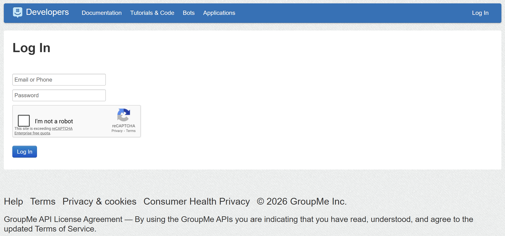
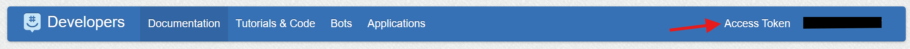
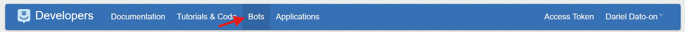

# openclaw-groupme

[](https://www.npmjs.com/package/openclaw-groupme)
[](https://www.npmjs.com/package/openclaw-groupme)
[](https://github.com/oddrationale/openclaw-groupme/actions/workflows/ci.yml)
[](https://github.com/oddrationale/openclaw-groupme/actions/workflows/codeql.yml)
[](LICENSE)
[](https://nodejs.org)
[](https://github.com/openclaw/openclaw)

An [OpenClaw](https://github.com/openclaw/openclaw) channel plugin that brings your AI agent into GroupMe group chats. It hooks into GroupMe's Bot API via webhooks so your agent can receive messages, understand context, and reply — all within the group conversations your team (or friends) are already having. Group chats only; DMs are not supported by the GroupMe Bot API.

## Requirements

- **OpenClaw** `>= 2026.6.1` — this plugin targets the 2026.6.1 plugin SDK.
- **Node.js** `>= 22.19.0` — matches OpenClaw's runtime.
- A reachable, public **HTTPS** endpoint for the GroupMe callback (see [Prerequisites](#prerequisites)).

> New to OpenClaw? Start with the [OpenClaw docs](https://docs.openclaw.ai) and the [channels overview](https://docs.openclaw.ai/channels).

## Install

```bash
openclaw plugins install clawhub:openclaw-groupme
```

You can also install directly from npm if you want npm to be the explicit source:

```bash
openclaw plugins install npm:openclaw-groupme
```

After installing, restart the gateway so it picks up the new plugin:

```bash
openclaw gateway restart
```

That's it — the plugin is loaded and ready to configure. (It ships compiled, so there's no build step on your end.)

## Prerequisites

Before you start wiring things up, make sure you have three things ready:

### 1. A GroupMe group

Bots in GroupMe live inside groups — there's no way to DM a bot directly. If you don't have one already, create a group using the [GroupMe web app](https://web.groupme.com/) or one of the mobile apps. You can also use an existing group you're already in.

### 2. A GroupMe access token

Head over to [dev.groupme.com](https://dev.groupme.com) to grab your access token.

**Heads up:** You must have a username and password set up on your GroupMe account to log in to the developer portal. The single sign-on options (Google, Microsoft, etc.) won't work here — only the classic email/phone + password login.



Once you're logged in, your access token is displayed in the top-right corner of the page. Click on it to copy.



> **Keep your access token secret.** This token has full access to your GroupMe account — it can post messages, join groups, manage bots, and more. Treat it like a password. Unfortunately, the only known way to revoke a compromised token is to change your GroupMe password, which isn't documented anywhere by GroupMe. So guard it carefully.

### 3. A public HTTPS URL

GroupMe needs to reach your OpenClaw gateway over the internet to deliver messages. You'll need a public HTTPS URL that routes to your gateway's webhook endpoint.

How you set this up depends entirely on your environment — a reverse proxy (Nginx, Caddy, Traefik), a Cloudflare tunnel, ngrok, Tailscale, or any number of other approaches will work. The important thing is:

- The URL must be **HTTPS** (GroupMe requires it).
- Only expose the **callback path** (e.g., `/groupme/...`) — don't open your entire gateway to the public internet.
- The domain must be **live and reachable** at setup time, because GroupMe pings the callback URL when you register a bot.

We can't cover every possible network setup here, but at the end of the day you need a public `https://your-domain.com/groupme/...` URL that reaches your OpenClaw gateway.

## Setup: Interactive Wizard (Recommended)

The interactive wizard is the easiest way to get started. It creates a new GroupMe bot, registers the callback URL, and writes all the config for you.

**1.** Run the channel setup command:

```bash
openclaw channels add
```

> You can also reach the same GroupMe wizard from the broader setup flows: `openclaw configure --section channels` or the first-run `openclaw onboard`.

**2.** Choose **GroupMe** from the channel list (use the arrow keys to select it).

**3.** Enter a **bot name**. This is the display name your bot will use in the group (e.g., `openclaw`). This name is also used for mention detection.

**4.** Paste your **GroupMe access token** when prompted.

**5.** The wizard fetches your groups from GroupMe. **Select the group** you want the bot to live in.

**6.** Choose whether to **require an @mention**:
   - **Yes** — The bot only responds when someone mentions it by name (e.g., "hey @openclaw, what's the weather?"). This is great for groups with multiple people where you don't want the bot jumping into every conversation.
   - **No** — The bot responds to every message in the group. Perfect if you're the only human in the group and want a direct chat experience.

**7.** Enter the **public domain** that will host your callback URL. This should be the domain name (or public IP) that can reach your OpenClaw gateway — for example, `bot.example.com`. The wizard generates a secure callback URL with a random path and secret token, then registers the bot with GroupMe.

**8.** The wizard writes the config and shows a summary of what was created.

**9.** Restart the gateway:

```bash
openclaw gateway restart
```

**10.** Send a test message in the GroupMe group. If everything is wired up correctly, your bot should respond. Make sure your reverse proxy or port forwarding is configured to route the callback URL to your gateway.

## Setup: Non-Interactive CLI

If you already have a GroupMe bot created (maybe from the [Bots page](https://dev.groupme.com/bots) on the developer portal) and want a scriptable setup, use the CLI flags directly:



```bash
openclaw channels add --channel groupme \
  --token "YOUR_GROUPME_BOT_ID" \
  --access-token "YOUR_GROUPME_ACCESS_TOKEN" \
  --webhook-path "/groupme/callback"
```

For named accounts (useful if you're running multiple bots):

```bash
openclaw channels add --channel groupme \
  --account work \
  --name "Work Bot" \
  --token "YOUR_GROUPME_BOT_ID" \
  --access-token "YOUR_GROUPME_ACCESS_TOKEN" \
  --webhook-path "/groupme/callback"
```

| Flag | Maps to config | Description |
| ---- | -------------- | ----------- |
| `--token` | `botId` | Your GroupMe Bot ID |
| `--access-token` | `accessToken` | Your GroupMe access token |
| `--webhook-url` | `webhookPath` (+ `callbackToken` if a `?k=` is present) | Full webhook URL; the path and `k` token are extracted |
| `--webhook-path` | `webhookPath` (+ `callbackToken` if a `?k=` is present) | Relative webhook route path |
| `--account` | account ID | Named account identifier |
| `--name` | `name` | Display name for the account |

> **Note:** The non-interactive CLI does not prompt for `botName`, `groupId`, `requireMention`, `publicDomain`, or `callbackToken`. Add those manually afterward (a `?k=<token>` on `--webhook-path`/`--webhook-url` is the one exception — it's parsed into `callbackToken`), or use the interactive wizard to generate complete webhook settings.

After adding the channel, make sure the callback URL you gave GroupMe uses the configured `webhookPath` and `callbackToken`. Then restart the gateway:

```bash
openclaw gateway restart
```

Run `openclaw channels add --help` to see the full list of per-channel flags.

## Manual Config Example

If you prefer editing config files directly, here's what a complete setup looks like:

```json
{
  "channels": {
    "groupme": {
      "enabled": true,
      "botName": "openclaw",
      "accessToken": "YOUR_GROUPME_ACCESS_TOKEN",
      "botId": "YOUR_GROUPME_BOT_ID",
      "groupId": "YOUR_GROUPME_GROUP_ID",
      "publicDomain": "bot.example.com",
      "webhookPath": "/groupme/e60b3e59da98950f",
      "callbackToken": "YOUR_SECRET_TOKEN",
      "requireMention": true
    }
  }
}
```

## Multiple Accounts

Each GroupMe bot is bound to a single group, so running the bot in more than one group means configuring more than one account. Top-level fields act as the `default` account, and additional accounts live under `accounts.<id>`. Named accounts inherit any fields you don't override.

```json
{
  "channels": {
    "groupme": {
      "enabled": true,
      "defaultAccount": "family",
      "botName": "openclaw",
      "accounts": {
        "family": {
          "name": "Family Bot",
          "accessToken": "FAMILY_ACCESS_TOKEN",
          "botId": "FAMILY_BOT_ID",
          "groupId": "FAMILY_GROUP_ID",
          "publicDomain": "bot.example.com",
          "webhookPath": "/groupme/family-a1b2c3",
          "callbackToken": "FAMILY_SECRET_TOKEN",
          "requireMention": false
        },
        "work": {
          "name": "Work Bot",
          "accessToken": "WORK_ACCESS_TOKEN",
          "botId": "WORK_BOT_ID",
          "groupId": "WORK_GROUP_ID",
          "publicDomain": "bot.example.com",
          "webhookPath": "/groupme/work-d4e5f6",
          "callbackToken": "WORK_SECRET_TOKEN",
          "requireMention": true
        }
      }
    }
  }
}
```

Each account needs its **own** `webhookPath` and `callbackToken`, since each registered bot has its own callback URL.

## Reconfiguring an Existing Setup

If GroupMe is already configured and you run `openclaw configure --section channels` (or `openclaw channels add`) again, you'll get a menu of targeted actions instead of repeating the full wizard:

- **Skip** — leave everything as-is
- **Rotate access token** — replace the stored access token (validates the new token by fetching your groups)
- **Change group** — pick a different GroupMe group and optionally register a new bot in it
- **Regenerate webhook settings** — create a new random webhook path and callback token (you'll need to update the bot's callback URL in GroupMe afterward)
- **Toggle requireMention** — flip mention-required mode on or off
- **Update public domain** — change the public domain used for callback URLs
- **Full re-setup** — start from scratch with the interactive wizard

This lets you make quick adjustments — like rotating a leaked token or moving the bot to a different group — without tearing down the whole config.

## Response Modes

### Always respond (`requireMention: false`)

The bot replies to every message in the group. Simple and direct.

```json
{
  "channels": {
    "groupme": {
      "requireMention": false
    }
  }
}
```

### Mention only (`requireMention: true`, default)

The bot only replies when someone mentions it by name. It still passively buffers recent messages so it has context when it does respond.

```json
{
  "channels": {
    "groupme": {
      "requireMention": true,
      "historyLimit": 30
    }
  }
}
```

Set `historyLimit: 0` to disable history buffering entirely.

### How Mention Detection Works

GroupMe bots don't support native @mention entities, so this plugin uses text matching. By default, it matches the `botName` in the message text. You can add custom patterns too:

```json
{
  "channels": {
    "groupme": {
      "botName": "openclaw",
      "mentionPatterns": [
        "@openclaw",
        "hey openclaw",
        "oc"
      ]
    }
  }
}
```

Patterns are case-insensitive regular expressions, so you can get creative with matching.

## Security

The plugin ships with some security defaults out of the box. Replay protection and rate limiting are always on — you don't need to configure anything for a solid baseline.

### Inbound Webhook Pipeline

Every incoming webhook request goes through this gauntlet before your agent ever sees it:

1. **Method check** — Only `POST` requests are accepted (405 for everything else)
2. **Callback token auth** — The `k` query parameter in the callback URL is verified against `callbackToken` using timing-safe comparison
3. **Proxy validation** — If configured, validates trusted proxy headers, allowed hosts, and HTTPS protocol
4. **Body parsing** — 64KB size limit, 15-second timeout
5. **Payload parsing** — Extracts the GroupMe callback data and filters out bot messages, system messages, and empty messages
6. **Group binding** — Verifies the inbound `group_id` matches the configured `groupId`
7. **Replay protection** — SHA-256 keyed deduplication with a sliding TTL window
8. **Rate limiting** — Per-IP, per-sender, and global concurrency caps

Accepted requests get an immediate `200 ok` and the message is processed asynchronously, so GroupMe never waits on your agent.

### Outbound Media Security

When the bot sends image replies, outbound media fetches are hardened with:

- SSRF guard with private-network blocking (enabled by default)
- MIME type allowlist (images only by default)
- Download size limit (15 MB)
- Request timeout (10 seconds)

### Security Config Reference

You only need a `security` block if you want to override the defaults. Just include the fields you want to change:

```json
{
  "channels": {
    "groupme": {
      "security": {
        "rateLimit": {
          "maxRequestsPerIp": 60
        },
        "proxy": {
          "trustedProxyCidrs": ["10.0.0.0/8"],
          "allowedPublicHosts": ["bot.example.com"],
          "requireHttpsProto": true
        }
      }
    }
  }
}
```

#### Replay Protection

| Field | Type | Default | Description |
| ----- | ---- | ------- | ----------- |
| `security.replay.ttlSeconds` | number | `600` | How long (in seconds) to remember message IDs for deduplication |
| `security.replay.maxEntries` | number | `10000` | Maximum number of entries in the replay cache |

#### Rate Limiting

| Field | Type | Default | Description |
| ----- | ---- | ------- | ----------- |
| `security.rateLimit.windowMs` | number | `60000` | Sliding window size in milliseconds |
| `security.rateLimit.maxRequestsPerIp` | number | `120` | Max webhook requests per IP per window |
| `security.rateLimit.maxRequestsPerSender` | number | `60` | Max webhook requests per GroupMe sender per window |
| `security.rateLimit.maxConcurrent` | number | `8` | Max concurrent inbound message executions |

#### Media

| Field | Type | Default | Description |
| ----- | ---- | ------- | ----------- |
| `security.media.allowPrivateNetworks` | boolean | `false` | Allow fetching media from private/internal networks |
| `security.media.maxDownloadBytes` | number | `15728640` | Max download size for outbound media (bytes) |
| `security.media.requestTimeoutMs` | number | `10000` | Timeout for outbound media fetch requests (ms) |
| `security.media.allowedMimePrefixes` | string[] | `["image/"]` | Allowed MIME type prefixes for outbound media |

> **Inbound vs. outbound media limits:** the `security.media.*` settings above govern **outbound** media — images the bot downloads from a URL and re-uploads to GroupMe. The separate top-level `mediaMaxMb` field governs **inbound** media the OpenClaw runtime fetches from GroupMe callbacks. They are independent knobs.

#### Logging

| Field | Type | Default | Description |
| ----- | ---- | ------- | ----------- |
| `security.logging.redactSecrets` | boolean | `true` | Redact callback secrets in logs and status output |
| `security.logging.logRejectedRequests` | boolean | `true` | Log rejected webhook requests |

#### Command Bypass

| Field | Type | Default | Description |
| ----- | ---- | ------- | ----------- |
| `security.commandBypass.requireAllowFrom` | boolean | `true` | Require sender to be in `allowFrom` list to use control commands |
| `security.commandBypass.requireMentionForCommands` | boolean | `false` | Require mention even for control commands |

#### Proxy Validation

Include a `proxy` block to enable trusted-proxy validation. This is useful when your gateway sits behind a reverse proxy and you want to validate forwarded headers.

| Field | Type | Default | Description |
| ----- | ---- | ------- | ----------- |
| `security.proxy.trustedProxyCidrs` | string[] | `[]` | Only trust `X-Forwarded-*` headers from these CIDRs |
| `security.proxy.allowedPublicHosts` | string[] | `[]` | Allowed values for the effective public host |
| `security.proxy.requireHttpsProto` | boolean | `false` | Require the effective protocol to be HTTPS |
| `security.proxy.rejectStatus` | number | `403` | HTTP status for proxy-policy rejections (`400`, `403`, or `404`) |

## Secrets

`botId`, `accessToken`, and `callbackToken` are OpenClaw secret inputs. You can store literal values, or use SecretRefs for env/file/exec-backed secrets. The plugin also declares `GROUPME_BOT_ID`, `GROUPME_ACCESS_TOKEN`, and `GROUPME_CALLBACK_TOKEN` as channel env vars, so the OpenClaw runtime can resolve those environment variables for the default account automatically.

```json
{
  "channels": {
    "groupme": {
      "botId": { "source": "env", "provider": "default", "id": "GROUPME_BOT_ID" },
      "accessToken": { "source": "env", "provider": "default", "id": "GROUPME_ACCESS_TOKEN" },
      "callbackToken": { "source": "env", "provider": "default", "id": "GROUPME_CALLBACK_TOKEN" },
      "groupId": "YOUR_GROUPME_GROUP_ID",
      "webhookPath": "/groupme/callback"
    }
  }
}
```

## Config Reference

| Field | Type | Default | Description |
| ----- | ---- | ------- | ----------- |
| `enabled` | boolean | `false` | Whether the GroupMe channel (or account) is active |
| `name` | string | — | Display name for the account |
| `botId` | secret input | — | GroupMe Bot ID |
| `accessToken` | secret input | — | GroupMe access token (required for image uploads and the interactive wizard) |
| `callbackToken` | secret input | — | Secret expected in the inbound `k` query parameter |
| `botName` | string | — | Bot display name, used for mention detection |
| `groupId` | string | — | Expected GroupMe `group_id` for inbound binding |
| `publicDomain` | string | — | Public domain where the gateway is reachable (e.g., `bot.example.com`) |
| `webhookPath` | string | `/groupme` | Relative webhook route path |
| `requireMention` | boolean | `true` | Only respond when mentioned by name |
| `historyLimit` | number | `20` | Max buffered messages per group (when `requireMention: true`); `0` disables buffering |
| `mentionPatterns` | string[] | — | Custom regex patterns for mention detection |
| `allowFrom` | array | — | Sender allowlist (`"*"` allows everyone) |
| `textChunkLimit` | number | `1000` | Max characters per outbound text chunk (capped at GroupMe's 1000-char limit) |
| `responsePrefix` | string | — | Text prepended to each outbound reply |
| `blockStreaming` | boolean | `false` | Stream completed assistant blocks as separate messages instead of one final reply |
| `blockStreamingCoalesce` | object | — | Fine-tunes how streamed blocks are coalesced (see OpenClaw docs) |
| `markdown` | object | — | Markdown rendering overrides for outbound messages |
| `mediaMaxMb` | number | — | Max size (MB) for **inbound** media the OpenClaw runtime fetches from GroupMe. Distinct from `security.media.maxDownloadBytes`, which caps **outbound** media the bot downloads before re-uploading. |
| `security` | object | — | Security overrides (see [Security](#security) section above) |
| `accounts` | object | — | Named accounts (`accounts.<id>`), each accepting the fields above |
| `defaultAccount` | string | — | Which named account is the default for outbound routing |

## Webhook URL Format

The plugin stores the route path and secret separately:

```json
{
  "webhookPath": "/groupme/e60b3e59da98950f",
  "callbackToken": "775c9958da544c73e6d97c04f884957caa174c8570889bbaa0900d6253f20bbc"
}
```

The full URL you register with GroupMe is your public domain plus the path and `k` token:

```
https://bot.example.com/groupme/e60b3e59da98950f?k=775c9958da544c73e6d97c04f884957caa174c8570889bbaa0900d6253f20bbc
```

## Notes and Limitations

### GroupMe Bot API Constraints

GroupMe bots are intentionally limited compared to full user accounts. These constraints come from the GroupMe Bot API itself, not from this plugin:

- **Group chats only** — bots cannot send or receive direct messages. Each bot is bound to a single group.
- **One group per bot** — a bot registration is tied to exactly one group. To serve multiple groups, register a separate bot (and account) for each.
- **No message history** — bots only see messages as they arrive via the callback webhook. They cannot fetch past messages from the group. (This plugin buffers recent messages locally for context when `requireMention` is enabled.)
- **No reactions** — bots cannot like or unlike messages.
- **Text and images only** — bots can post text and attach a single image per message. Other attachment types (video, files, locations) are not supported.

### Plugin-Specific Notes

- Bot and system messages from GroupMe are automatically ignored
- GroupMe has a 1000-character limit per message — longer replies are chunked automatically
- Image replies require `accessToken` so the plugin can upload images to GroupMe's Image Service
- The interactive wizard registers the bot with GroupMe using your `publicDomain`, so **your domain must be live and reachable** during setup
- If you change your domain later, update `publicDomain` in your config and update the bot's callback URL at [dev.groupme.com/bots](https://dev.groupme.com/bots)

## Troubleshooting

- **Bot doesn't respond:**
  - Is your webhook URL public, HTTPS, and matching `webhookPath` plus `callbackToken`?
  - Does `groupId` match the actual GroupMe group ID?
  - Is `botId` correct?
  - If `requireMention: true`, are you mentioning the bot by name?
  - Check `allowFrom` if you have a sender allowlist configured

- **Webhook returns 404 or 403:**
  - Verify the `k` token in the URL matches `callbackToken`
  - Check `groupId` binding
  - If using proxy validation, check your `security.proxy` settings

- **Bot responds but has no context:**
  - Make sure `historyLimit` is not `0`
  - History buffering only applies when `requireMention: true`

- **Image replies fail:**
  - Make sure `accessToken` is configured

- **Bot registration fails with "callback URL validation has failed":**
  - GroupMe pings the callback domain when you register a bot
  - Your public domain must be live and reachable at setup time
  - Test it: `curl -I https://your-domain.com`

- **Check runtime logs:**

```bash
openclaw channels logs --channel groupme
```

- **Check channel status:**

```bash
openclaw channels status --probe
```

## Resources

- [OpenClaw documentation](https://docs.openclaw.ai) · [Channels](https://docs.openclaw.ai/channels) · [Plugins](https://docs.openclaw.ai/plugins)
- [GroupMe developer portal](https://dev.groupme.com) · [Bots](https://dev.groupme.com/bots)
- [Contributing guide](CONTRIBUTING.md) · [Security policy](SECURITY.md) · [Changelog](CHANGELOG.md)

## License

[MIT](LICENSE)
